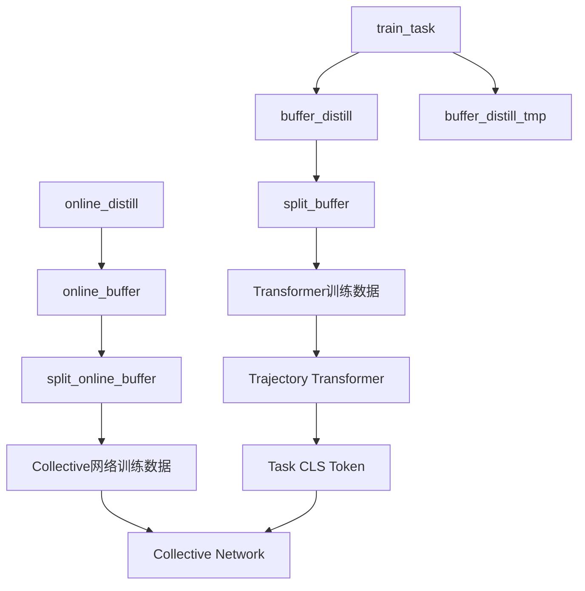

# 详细训练流程分析 - Detailed Training Pipeline Analysis

## 🔍 回答你的关键问题

### 1. online_distill 的困惑解析

**你的疑问**: online_distill 看起来在训练 collective network，但需要 transformer 输入，为什么先运行 online_distill 再训练 transformer？

**解答**: 这里有一个重要区分：

- **online_distill** (`online_distill_collective_transformer` 模式) **不是**训练 trajectory transformer
- 它训练的是 **collective network** (带有 transformer 编码器的 SAC agent)
- 真正的 **trajectory transformer** (用于生成 task CLS token) 是在 `Transformer_RNN/RepresentationTransformerWithCLS.py` 中单独训练的

**具体流程**:
```python
# online_distill 做什么:
def run_online_distillation(self):
    # 1. 加载预训练的专家模型
    for i in self.env_indices_i:
        self.expert[i].load_latest_step(model_dir=self.expert_model_dir[i])
    
    # 2. 使用专家生成演示数据
    action[self.env_indices[i]] = self.expert[i].sample_action(...)
    
    # 3. 训练 collective network (不是 trajectory transformer!)
    self.col_agent.distill_actor(self.replay_buffer, ...)
    
    # 4. 保存为 online_buffer_${task_name}
```

所以 online_distill **不依赖** trajectory transformer，它只是用专家来训练 collective network。

### 2. 代码与论文结构对应关系

| 论文组件 | 代码实现 | 对应的模式/文件 |
|---------|---------|----------------|
| **Expert SAC agents** | 单任务专家训练 | `train_task` 模式 |
| **Data Collection** | 专家演示数据生成 | `online_distill` 模式 |
| **Trajectory Transformer** | 任务 CLS token 生成器 | `Transformer_RNN/RepresentationTransformerWithCLS.py` |
| **Downstream Agent** | 带 CLS token 的集体 SAC | `distill_collective_transformer` 模式 |
| **Student Learning** | 奖励塑形的学生学习 | `train_student` 模式 |

**详细对应分析**:

#### 📊 Expert SAC Agents
```bash
# 训练多个单任务专家
train_task reach-v2 100000
train_task push-v2 900000
# 每个任务保存: model_${task_name}_seed_1
```

#### 📈 Data Collection  
```bash
# 使用专家生成演示数据
online_distill reach-v2
online_distill push-v2
# 生成: online_buffer_${task_name}
```

#### 🧠 Trajectory Transformer
```bash
# 准备训练数据
split_buffer reach-v2  # buffer_distill -> train/val for transformer

# 训练 trajectory transformer
python3 Transformer_RNN/dataset_tf.py      # 数据预处理
python3 Transformer_RNN/RepresentationTransformerWithCLS.py  # 训练 CLS token
```

#### 🤖 Downstream Agent (Collective Network)
```bash
# 准备集体学习数据
split_online_buffer reach-v2  # online_buffer -> train/val for collective

# 训练集体网络
python3 -u main.py ... experiment.mode=distill_collective_transformer
```

#### 🎓 Student Learning
```bash
train_student reach-v2  # 学生学习模式
```

### 3. Buffer 依赖关系详解



**Buffer 作用分析**:

| Buffer 类型 | 生成阶段 | 用途 | 必需性 |
|------------|---------|------|--------|
| `buffer_distill` | train_task | Trajectory Transformer 训练 | ✅ 必需 |
| `buffer_distill_tmp` | train_task | 临时缓存 | ⚠️ 中间文件 |
| `online_buffer` | online_distill | Collective Network 训练 | ✅ 必需 |

### 4. col_agent vs student 区别

**col_agent (Collective Agent)**:
- **作用**: 多任务共享的 SAC agent，使用 trajectory transformer 的 CLS token
- **训练**: `distill_collective_transformer` 模式
- **架构**: SAC + Transformer Encoder + CLS Token
- **目标**: 学习跨任务的共享策略

**student (Student Agent)**:
- **作用**: 通过模仿学习和奖励塑形学习的 agent
- **训练**: `train_student` 模式  
- **架构**: 标准 SAC + 奖励塑形
- **目标**: 改进单任务性能

### 5. Trajectory Transformer 监督训练机制

**关键发现**: Trajectory Transformer 使用 **自监督学习**，不需要显式的任务标签！

**训练机制分析**:
```python
# 在 RepresentationTransformerWithCLS.py 中
class EncoderOnlyTransformerModel(nn.Module):
    def forward(self, states, actions):
        # 1. 输入轨迹序列 (states, actions)
        state_emb = self.state_emb(states)
        action_emb = self.action_emb(actions)
        
        # 2. 序列编码 + CLS token
        sequence_emb = torch.cat([state_emb, action_emb], dim=-1)
        cls_token = self.cls_token.expand(batch_size, 1, -1)
        sequence_with_cls = torch.cat([cls_token, sequence_emb], dim=1)
        
        # 3. Transformer 编码
        encoded = self.transformer(sequence_with_cls)
        
        # 4. CLS token 输出 (包含任务信息)
        task_encoding = encoded[:, 0]  # 第一个位置是 CLS token
        
        return task_encoding
```

**监督信号来源**:
1. **序列重构**: 学习预测轨迹中的缺失部分
2. **对比学习**: 同任务轨迹相似，不同任务轨迹分离
3. **信息瓶颈**: CLS token 必须包含足够信息来区分任务

**为什么有效**:
- 不同任务的轨迹模式不同 (reach vs push vs pick-place)
- Transformer 学习将任务特定的模式编码到 CLS token 中
- CLS token 自然地学会区分任务，无需显式标签

## 🔄 完整训练流程总结

### 阶段 1: Expert Training
```bash
train_task reach-v2 100000
# 输出: model_reach-v2_seed_1, buffer_distill_reach-v2_seed_1
```

### 阶段 2: Data Generation  
```bash
online_distill reach-v2
# 输出: online_buffer_reach-v2
```

### 阶段 3: Data Preparation
```bash
# 为 trajectory transformer 准备数据
split_buffer reach-v2
# 输出: train/buffer_distill_reach-v2_seed_1, validation/buffer_distill_reach-v2_seed_1

# 为 collective network 准备数据  
split_online_buffer reach-v2
# 输出: train/online_buffer_reach-v2_seed_1, validation/online_buffer_reach-v2_seed_1
```

### 阶段 4a: Trajectory Transformer Training
```bash
python3 Transformer_RNN/dataset_tf.py
python3 Transformer_RNN/RepresentationTransformerWithCLS.py
# 输出: 训练好的 CLS token 生成器
```

### 阶段 4b: Collective Network Training
```bash
python3 -u main.py ... experiment.mode=distill_collective_transformer
# 输出: model_col (集体网络模型)
```

### 阶段 5: Student Learning (可选)
```bash
train_student reach-v2
# 输出: student_model_reach-v2_seed_1
```

## 🎯 关键理解要点

1. **online_distill 不训练 trajectory transformer**，它训练 collective network
2. **Trajectory transformer 独立训练**，使用自监督学习生成 CLS token
3. **两个并行的数据流**: buffer_distill → transformer, online_buffer → collective network  
4. **col_agent 是主要的多任务 agent**，student 是可选的改进组件
5. **CLS token 通过轨迹模式自动学习任务区分**，无需显式监督

这个架构的核心思想是：通过自监督的轨迹学习来获得任务表示，然后用这个表示来指导多任务策略学习。